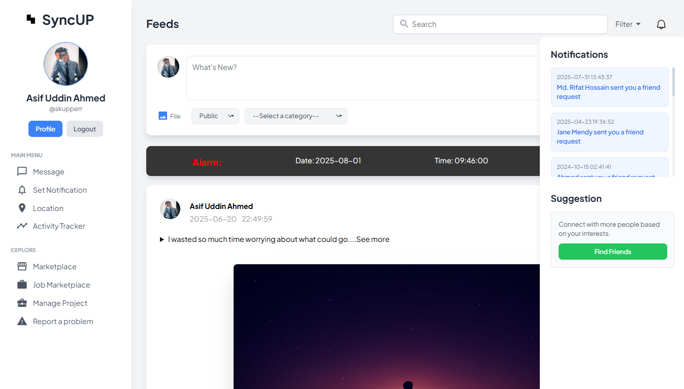
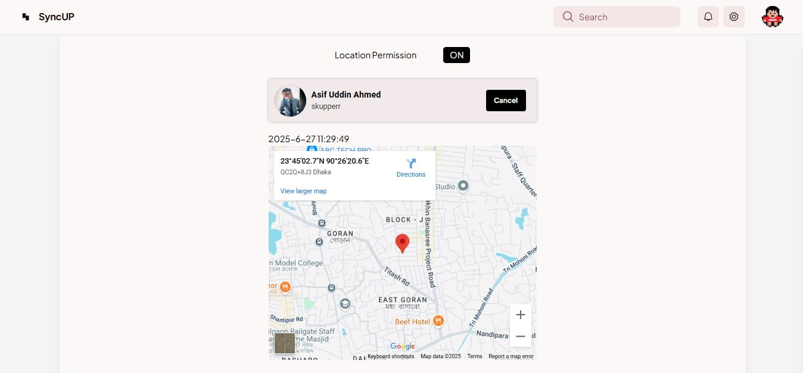
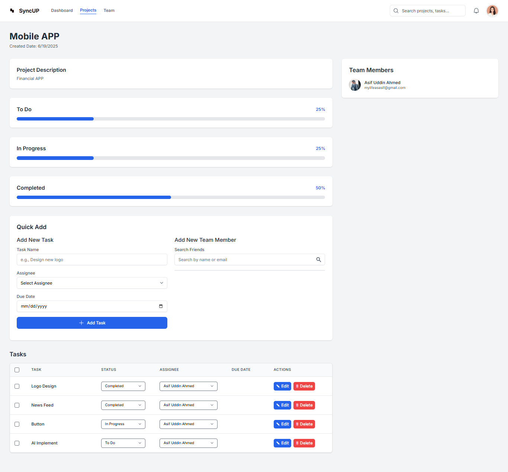
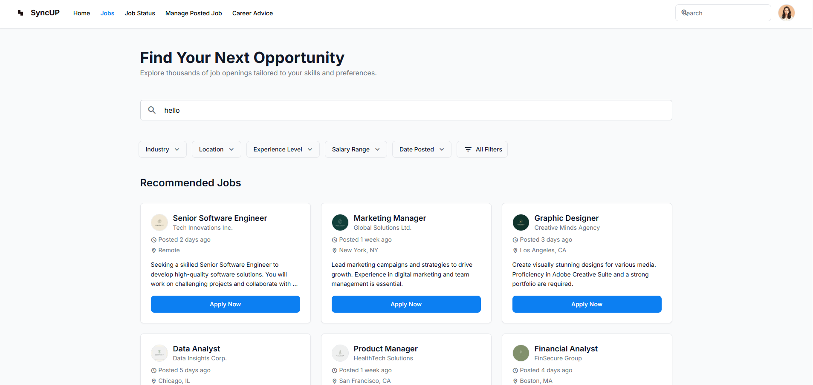
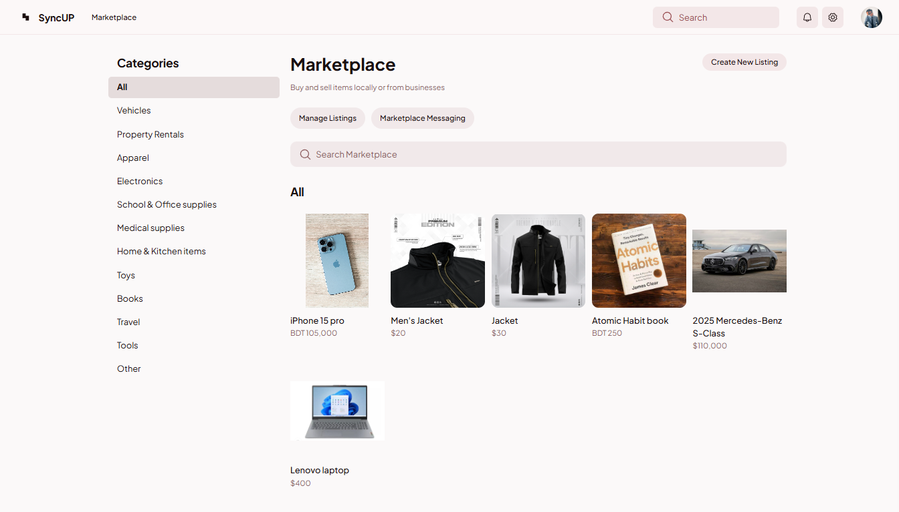

<div align="center">

# 🔗 SyncUp — Smart Social Networking Meets Productivity

[](https://choosealicense.com/licenses/mit/)
[](#)
[](#)

> A personalized, and productivity-focused social platform for students and professionals.

**SyncUp** is a modern full-stack social media platform that blends **social networking** with **task management**, and **career tools**. Built to foster authentic, meaningful, and growth-focused online experiences.

</div>

---

## 🛠️ Tech Stack

### Frontend
[](https://developer.mozilla.org/en-US/docs/Glossary/HTML5)
[](https://developer.mozilla.org/en-US/docs/Web/CSS)
[](https://developer.mozilla.org/en-US/docs/Web/JavaScript)


### Backend
[](https://developer.mozilla.org/en-US/docs/Glossary/HTML5)
[](https://developer.mozilla.org/en-US/docs/Glossary/HTML5)
[](https://developer.mozilla.org/en-US/docs/Glossary/HTML5)
[](https://developer.mozilla.org/en-US/docs/Glossary/HTML5)

---

## 🚀 Features

- 🙍 **Profile & Friends**
  - Update profile info, manage friend requests

- 📱 **Feed & Content**
  - Create posts with text, images, videos
  - Like, comment, and share posts
  - Track engagement with posts (views, likes, saved items)

- 🧠 **Personalized Feed**
  - Filter feed by interest/profession
  - Ability to change and update feed filters <br><br>
  

- 🎯 **Personalized Notifications**
	- Users receive event reminders or friend activity alerts
	- Set and customize notifications for tasks

- 📍 **Location Sharing**
	- Real-time location sharing with trusted friends
	- Enable/disable sharing anytime <br><br>
  

- 🧩 **Tasks Management**
  - Create personal and group tasks
  - Assign tasks to members, track progress, and mark completion <br><br>
  

- 💼 **Job Marketplace**
  - Post job listings or search for jobs
  - Apply to jobs directly from the platform <br><br>
  

- 🔍 **Online Marketplace**
  - Buy/sell items within the platform <br><br>
  

- 💬 **Real-Time Messaging**
  - Real-time messaging system between users <br><br>
  

- 📊 **Content Analytics**
  - View interacted content insight

---

## 📁 Project Structure
```
SyncUp/
├── backend/
│ ├── app.js
│ ├── db_service.js
│ └── .env
│
├── frontend/
│ ├── chat/
│ ├── Friend List/
│ ├── JobHTML/
│ ├── Job/
│ ├── JobJS/
│ ├── manageProject/
│ ├── Marketplace/
│ ├── newsFeed/
│ ├── other_profile/
│ ├── Profile_page/
│ ├── Progressbar/
│ ├── Report_problem/
│ ├── timer/
│ ├── web page/
│ └── all js files.js
│
├── README.md
└── .env
```

## 📬 Contact

Created with ❤️ by [Asif U. Ahmed](https://github.com/skupperr) and [MD. Rifat Hossain](https://github.com/mdrifat-hossain)